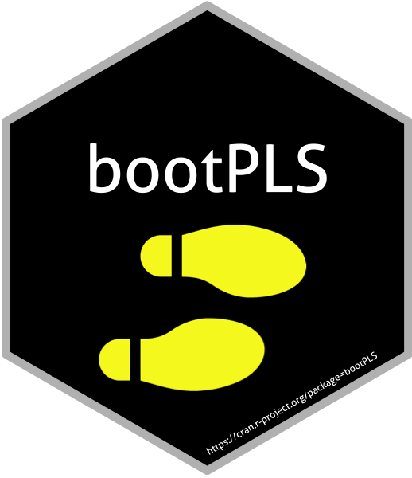

<!-- README.md is generated from README.Rmd. Please edit that file -->

```{r setup, include = FALSE}
knitr::opts_chunk$set(
  collapse = TRUE,
  comment = "#>",
  fig.path = "man/figures/README-",
  out.width = "100%",
  dpi=300,fig.width=7,
  fig.keep="all"
)
```

# bootPLS 

# bootPLS, using bootstrap to find hyperparameters for Partial Least Squares Regression models and their extensions

## Frédéric Bertrand, Jeremy Magnanensi and Myriam Maumy-Bertrand

<https://doi.org/10.32614/CRAN.package.bootPLS>

<!-- badges: start -->
[](https://doi.org/10.32614/CRAN.package.bootPLS)
[](https://lifecycle.r-lib.org/articles/stages.html)
[](https://www.repostatus.org/#active)
[](https://github.com/fbertran/bootPLS/actions)
[](https://app.codecov.io/gh/fbertran/bootPLS?branch=master)
[](https://cran.r-project.org/package=bootPLS)
[](https://cran.r-project.org/package=bootPLS)
[](https://github.com/fbertran/bootPLS)
<!-- badges: end -->

The goal of bootPLS is to provide several non-parametric stable bootstrap-based techniques to determine the numbers of components in Partial Least Squares and sparse Partial Least Squares linear or generalized linear regression.

`bootPLS` implements several algorithms that were published as a  book chapter and two articles.

* A new bootstrap-based stopping criterion in PLS component construction, J. Magnanensi, M. Maumy-Bertrand, N. Meyer and F. Bertrand (2016), in *The Multiple Facets of Partial Least Squares and Related Methods*. doi:10.1007/978-3-319-40643-5_18.

* A new universal resample-stable bootstrap-based stopping criterion for PLS component construction, J. Magnanensi, F. Bertrand, M. Maumy-Bertrand and N. Meyer, (2017), *Statistics and Computing*, 27, 757–774. doi:10.1007/s11222-016-9651-4.

* New developments in Sparse PLS regression, J. Magnanensi, M. Maumy-Bertrand, N. Meyer and F. Bertrand, (2021), *Frontiers in Applied Mathematics and Statistics*. doi:10.3389/fams.2021.693126.

Support for parallel computation and GPU is being developed.

This website and these examples were created by F. Bertrand and M. Maumy-Bertrand.

## Installation

You can install the released version of bootPLS from [CRAN](https://CRAN.R-project.org) with:

```{r, eval = FALSE}
install.packages("bootPLS")
```

You can install the development version of bootPLS from [github](https://github.com) with:

```{r, eval = FALSE}
devtools::install_github("fbertran/bootPLS")
```

# Pine real dataset: pls and spls regressions
## Loading and displaying dataset
Load and display the pinewood worm dataset.
```{r pine}
library(bootPLS)
library(plsRglm)
data(pine, package = "plsRglm")
Xpine<-pine[,1:10]
ypine<-log(pine[,11])
```

```{r pinedisplay, cache=TRUE}
pairs(pine)
```

Michel Tenenhaus' reported in his book, *La régression PLS* (1998) Technip, Paris, that most of the expert biologists claimed that this dataset features two latent variables, which is tantamount to the PLS model having two components.

## PLS LOO and CV
Leave one out CV (`K=nrow(pine)`) one time (`NK=1`).
```{r pinecv, cache=TRUE}
bbb <- plsRglm::cv.plsR(log(x11)~.,data=pine,nt=6,K=nrow(pine),NK=1,verbose=FALSE)
plsRglm::cvtable(summary(bbb))
```

Set up 6-fold CV (`K=6`), 100 times (`NK=100`), and use `random=TRUE` to randomly create folds for repeated CV.
```{r pinecvrep, cache=TRUE}
bbb2 <- plsRglm::cv.plsR(log(x11)~.,data=pine,nt=6,K=6,NK=100,verbose=FALSE)
```

Display the results of the cross-validation. 
```{r pinecvtable, cache=TRUE}
plsRglm::cvtable(summary(bbb2))
```

The $Q^2$ criterion is recommended in that PLSR setting without missing data. A model with 1 component is selected by the cross-validation as displayed by the following figure. Hence the $Q^2$ criterion (1 component) does not agree with the experts (2 components). 

```{r pineplotcvtableQ2, cache=TRUE}
plot(plsRglm::cvtable(summary(bbb2)),type="CVQ2")
```

As for the CV Press criterion it is unable to point out a unique number of components.
```{r pineplotcvtablePress, cache=TRUE}
plot(plsRglm::cvtable(summary(bbb2)),type="CVPress")
```

## PLS (Y,T) Bootstrap

The package features our bootstrap based algorithm to select the number of components in plsR regression. It is implemented with the `nbcomp.bootplsR` function.
 
```{r nbcompbootplsR, cache=TRUE}
set.seed(4619)
nbcomp.bootplsR(Y=ypine,X=Xpine,R =500)
```

The `verbose=FALSE` option  suppresses messages output during the algorithm, which is useful to replicate the bootstrap technique. To set up parallel computing, you can use the `parallel` and the `ncpus` options.
```{r, resbootrep, cache=TRUE}
set.seed(4619)
res_boot_rep <- replicate(20,nbcomp.bootplsR(Y=ypine,X=Xpine,R =500,verbose =FALSE,parallel = "multicore",ncpus = 2))
```

It is easy to display the results with the `barplot` function.
```{r barplotresbootrep, cache=TRUE}
barplot(table(res_boot_rep))
```

A model with two components should be selected using our bootstrap based algorithm to select the number of components. Hence the number of component selected with our algorithm agrees with what was stated by the experts.


## sPLS (Y,T) Bootstrap

The package also features our bootstrap based algorithm to select, for a given $\eta$ value, the number of components in spls regression. It is implemented with the `nbcomp.bootspls` function.
```{r nbcompbootspls, cache=TRUE}
nbcomp.bootspls(x=Xpine,y=ypine,eta=.5)
```

A `doParallel` and `foreach` based parallel computing version of the algorithm is implemented as the `nbcomp.bootspls.para` function.
```{r spls, cache=TRUE}
nbcomp.bootspls.para(x=Xpine,y=ypine,eta=.5)
nbcomp.bootspls.para(x=Xpine,y=ypine,eta=c(.2,.5))
```

## Bootstrap (Y,X) for the coefficients with number of components updated for each resampling

Pinewood worm data reloaded.
```{r pinereload, cache=TRUE}
library(bootPLS)
library(plsRglm)
data(pine, package = "plsRglm")
Xpine<-pine[,1:10]
ypine<-log(pine[,11])
datasetpine <- cbind(ypine,Xpine)
```

```{r pineadaptyx, cache=TRUE}
coefs.plsR.adapt.ncomp(datasetpine,sample(1:nrow(datasetpine)))
```
Replicate the results to get the bootstrap distributions of the selected number of components and the coefficients.
```{r pineadaptyxreplicate, cache=TRUE}
replicate(20,coefs.plsR.adapt.ncomp(datasetpine,sample(1:nrow(datasetpine))))
```

Parallel computing support with the `ncpus` and `parallel="multicore"` options.
```{r pineadaptmc, cache=TRUE}
coefs.plsR.adapt.ncomp(datasetpine,sample(1:nrow(datasetpine)),ncpus=2,parallel="multicore")
```

```{r pineadaptmcreplicate, cache=TRUE}
replicate(20,coefs.plsR.adapt.ncomp(datasetpine,sample(1:nrow(datasetpine)),ncpus=2,parallel="multicore"))
```

# Aze real dataset: binary logistic plsRglm and sgpls regressions

## PLSGLR (Y,T) Bootstrap

Loading the data and creating the data frames.
```{r azeload, cache=TRUE}
data(aze_compl)
Xaze_compl<-aze_compl[,2:34]
yaze_compl<-aze_compl$y
dataset <- cbind(y=yaze_compl,Xaze_compl)
```

Fitting a logistic PLS regression model with 10 components. You have to use the family option when fitting the plsRglm.
```{r azefit, cache=TRUE}
modplsglm <- plsRglm(y~.,data=dataset,10,modele="pls-glm-family",family="binomial")
```
Perform the bootstrap based algorithm with the `nbcomp.bootplsRglm` function. By default 250 resamplings are carried out.
```{r azebootcomp, cache=TRUE}
set.seed(4619)
aze_compl.bootYT <- suppressWarnings(nbcomp.bootplsRglm(modplsglm))
```

Plotting the bootstrap distributions of the coefficients of the components.
```{r azeplotbootcomp, cache=TRUE}
plsRglm::boxplots.bootpls(aze_compl.bootYT)
```

Computing the bootstrap based confidence intervals of the coefficients of the components.

```{r azebootcompCI, cache=TRUE}
plsRglm::confints.bootpls(aze_compl.bootYT)
```

Computing the bootstrap based confidence intervals of the coefficients of the components.

```{r azebootcompplotCI, cache=TRUE}
suppressWarnings(plsRglm::plots.confints.bootpls(plsRglm::confints.bootpls(aze_compl.bootYT)))
```

## sparse PLSGLR (Y,T) Bootstrap

The package also features our bootstrap based algorithm to select, for a given $\eta$ value, the number of components in sgpls regression. It is implemented in the `nbcomp.bootsgpls`.

```{r prostateload, cache=TRUE}
set.seed(4619)
data(prostate, package="spls")
nbcomp.bootsgpls((prostate$x)[,1:30], prostate$y, R=250, eta=0.2, typeBCa = FALSE)
```
A `doParallel` and `foreach` based parallel computing version of the algorithm is implemented as the `nbcomp.bootspls.para` function.
```{r prostatespls, cache=TRUE}
nbcomp.bootsgpls.para((prostate$x)[,1:30], prostate$y, R=250, eta=c(.2,.5), maxnt=10, typeBCa = FALSE)
```


```{r clean, cache=TRUE}
rm(list=c("Xpine","ypine","bbb","bbb2","aze_compl","Xaze_compl","yaze_compl","aze_compl.bootYT","dataset","modplsglm","pine","datasetpine","prostate","res_boot_rep"))
```

